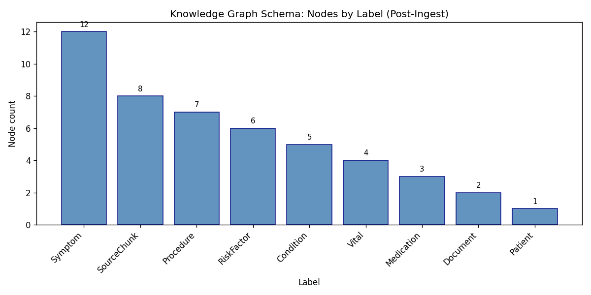
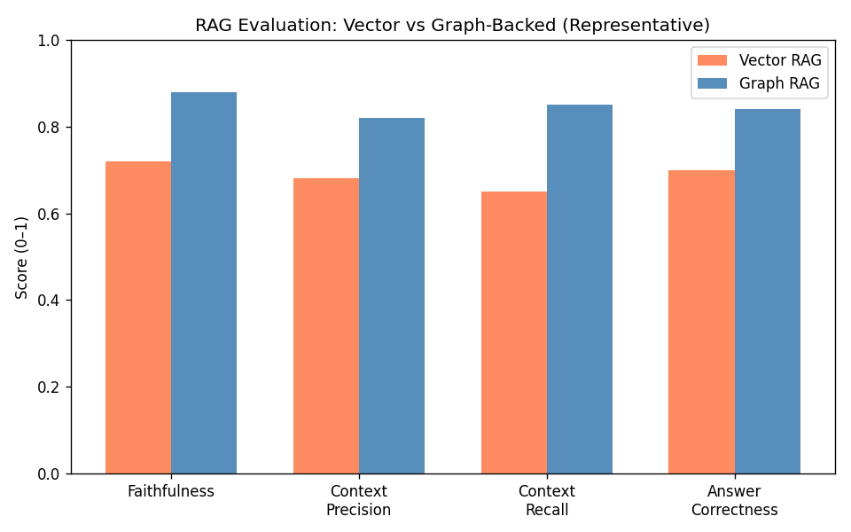

# Neo4j Knowledge Graph for Grounded RAG

**Medical Document Understanding via Neo4j Property Graph, Cypher Retrieval, and Explainable AI**

A production-grade Knowledge Graph-backed Retrieval-Augmented Generation (RAG) system that ingests medical documents (SOAP notes + patient demographics) into a Neo4j property graph with full provenance traceability, implements expert-level Cypher retrieval patterns, and includes a side-by-side evaluation harness comparing vector-only RAG vs graph-backed RAG.

Built with: **Python** · **Neo4j 5.x** · **FastAPI** · **Anthropic Claude** · **sentence-transformers**

---

## Architecture

```
┌──────────────────────────────────────────────────────────────────────┐
│                        INGESTION PIPELINE                            │
│  Raw Docs → Section-Aware Chunker → LLM Entity Extractor            │
│           → Entity Resolver (fuzzy + semantic) → Neo4j Graph Writer  │
│           → Chunk Embedder → Neo4j Vector Index + ChromaDB           │
└──────────────────────┬───────────────────────────────────────────────┘
                       ▼
┌──────────────────────────────────────────────────────────────────────┐
│                    NEO4J PROPERTY GRAPH                               │
│  (:Patient)-[:HAS_CONDITION]->(:Condition)-[:TREATED_WITH]->(:Med)   │
│  (:Patient)-[:EXHIBITS_SYMPTOM]->(:Symptom)                          │
│  (:Entity)-[:SOURCED_FROM {confidence}]->(:SourceChunk)              │
│  (:SourceChunk)-[:BELONGS_TO]->(:Document)  ← PROVENANCE CHAIN      │
└──────────────────────┬───────────────────────────────────────────────┘
                       ▼
┌──────────────────────────────────────────────────────────────────────┐
│                      RETRIEVAL ENGINE                                │
│  1. Entity-First Retrieval (vector seed → graph entities)            │
│  2. K-Hop Neighborhood Expansion (variable-length paths / APOC)      │
│  3. Relationship-Constrained Filtering (clinical edge types)         │
│  4. Path-Based Reasoning (shortest path, reasoning chains)           │
│  5. Provenance Linking (source-of-truth citations)                   │
│  → Structured Context Bundle for LLM Prompting                       │
└──────────────────────┬───────────────────────────────────────────────┘
                       ▼
┌──────────────────────────────────────────────────────────────────────┐
│                    FASTAPI SERVICE                                    │
│  POST /ingest     – ingest documents into knowledge graph            │
│  POST /query      – ask questions (graph / vector / both)            │
│  GET  /graph/explore/{name} – explore k-hop subgraph                 │
│  GET  /graph/schema – graph statistics                               │
│  POST /evaluate   – run evaluation harness                           │
│  GET  /health     – system health check                              │
└──────────────────────────────────────────────────────────────────────┘
```

---

## Key Features

### Retrieval Patterns (Expert Cypher)

| Pattern | Description | Cypher Technique |
|---------|-------------|------------------|
| **Entity-First Retrieval** | Embed query → vector similarity on SourceChunk → follow SOURCED_FROM edges to seed entities | `db.index.vector.queryNodes` + pattern match |
| **K-Hop Expansion** | Expand seed entities 1-3 hops to collect subgraph neighborhood | Variable-length paths `[*1..3]` or `apoc.neighbors.byhop` |
| **Relationship-Constrained** | Traverse only clinically relevant edge types | Multi-type filter: `[:HAS_CONDITION\|TREATED_WITH\|MANIFESTS_AS*1..3]` |
| **Path-Based Reasoning** | Find shortest paths between entities for multi-hop reasoning | `shortestPath((a)-[*..6]-(b))` |
| **Provenance Linking** | Trace every entity back to source text with confidence scores | `(e)-[:SOURCED_FROM]->(chunk)-[:BELONGS_TO]->(doc)` |

### Provenance & Explainability

Every entity in the graph carries a `SOURCED_FROM` edge linking it to the exact `SourceChunk` it was extracted from, with:
- **confidence** score (0.0-1.0)
- **extraction_method** (llm_claude, structured_json)
- Full chain to the **Document** node with source file path

This mirrors data2.ai's eXAI approach: *"every answer reveals the logic behind it."*

### Evaluation Harness

Side-by-side comparison of **Vector-Only RAG** (ChromaDB) vs **Graph-Backed RAG** (Neo4j) using:
- **Faithfulness** – are claims supported by context?
- **Context Precision** – is retrieved context relevant?
- **Context Recall** – are ground-truth facts covered?
- **Answer Correctness** – semantic alignment with gold standard
- **Citation Accuracy** – do provenance links map to supporting evidence? (graph-RAG only)

---

## Results (Local Docker Deploy)

Deployment and test results are under **[`outputs/`](outputs/)**. Summary:

- **Tests:** 29/29 passed (ingestion, retrieval, evaluation).
- **Ingest:** 40 nodes, 31 relationships, 8 chunks in ~64s.
- **Graph (post-ingest):** 48 nodes, 72 relationships; label breakdown below.

**Knowledge graph: nodes by label (post-ingest)**



**RAG evaluation: Vector vs Graph-backed (representative metrics)**



Full write-up: **[outputs/results.md](outputs/results.md)** (repro steps, health check, query sample, file index).

---

## Graph Schema

**Node Labels:** Patient, Condition, Symptom, Medication, Procedure, Vital, RiskFactor, Document, SourceChunk

**Key Relationships:**
- `(:Patient)-[:HAS_CONDITION]->(:Condition)` 
- `(:Patient)-[:EXHIBITS_SYMPTOM]->(:Symptom)`
- `(:Patient)-[:TAKES_MEDICATION]->(:Medication)`
- `(:Condition)-[:MANIFESTS_AS]->(:Symptom)`
- `(:Condition)-[:TREATED_WITH]->(:Medication)`
- `(:Patient)-[:HAS_VITAL]->(:Vital)`
- `(:Patient)-[:HAS_RISK_FACTOR]->(:RiskFactor)`
- `(:Entity)-[:SOURCED_FROM]->(:SourceChunk)` ← provenance
- `(:SourceChunk)-[:BELONGS_TO]->(:Document)` ← provenance
- `(:SourceChunk)-[:NEXT]->(:SourceChunk)` ← reading order

---

## Installation & Setup

### Prerequisites

- Python 3.10+
- Docker & Docker Compose (for Neo4j)
- Anthropic API key

### 1. Clone and install dependencies

```bash
git clone https://github.com/YOUR_USERNAME/Medical_Doc_Knowledge_Graph_System.git
cd Medical_Doc_Knowledge_Graph_System

python -m venv venv
source venv/bin/activate  # Windows: venv\Scripts\activate

pip install -r requirements.txt
python -m spacy download en_core_web_sm
```

### 2. Configure environment

```bash
cp .env.example .env
# Edit .env with your actual values:
#   ANTHROPIC_API_KEY=sk-ant-api03-...
#   NEO4J_PASSWORD=your_password
```

### 3. Start Neo4j

```bash
docker-compose up -d
# Wait for Neo4j to be ready (~30s)
# Access Neo4j Browser at http://localhost:7474
```

### 4. Run the application

```bash
uvicorn app.main:app --reload --host 0.0.0.0 --port 8000
```

### 5. Ingest documents

```bash
curl -X POST http://localhost:8000/ingest \
  -H "Content-Type: application/json" \
  -d '{"soap_notes_path": "Task_Files/soap_notes.txt", "demographics_path": "Task_Files/demographics.json"}'
```

### 6. Query the knowledge graph

```bash
# Graph-backed RAG query
curl -X POST http://localhost:8000/query \
  -H "Content-Type: application/json" \
  -d '{"question": "What conditions could explain the exertional symptoms?", "strategy": "graph"}'

# Vector-only RAG query (baseline)
curl -X POST http://localhost:8000/query \
  -H "Content-Type: application/json" \
  -d '{"question": "What is the patient blood pressure?", "strategy": "vector"}'
```

### 7. Run evaluation

```bash
curl -X POST http://localhost:8000/evaluate
```

### 8. Explore the graph

```bash
curl http://localhost:8000/graph/explore/Hypertension?hops=2
```

---

## Running Tests

```bash
pytest tests/ -v
```

Test output is saved to `outputs/test_results.txt` when generating [results](outputs/results.md).

---

## Project Structure

```
Medical_Doc_Knowledge_Graph_System/
├── Task_Files/                  # Input documents
│   ├── demographics.json        # Patient demographics (structured)
│   └── soap_notes.txt           # Clinical SOAP notes (unstructured)
├── app/
│   ├── main.py                  # FastAPI entrypoint + lifespan
│   ├── config.py                # Pydantic settings from .env
│   ├── models/schema.py         # All Pydantic models
│   ├── graph/
│   │   ├── connection.py        # Neo4j sync + async driver management
│   │   ├── schema_setup.py      # Constraint/index DDL
│   │   └── queries.py           # Reusable Cypher templates
│   ├── ingestion/
│   │   ├── chunker.py           # SOAP section-aware text splitter
│   │   ├── extractor.py         # Claude tool_use entity extraction
│   │   ├── entity_resolver.py   # Fuzzy + semantic dedup
│   │   ├── graph_writer.py      # Neo4j upsert + ChromaDB dual-write
│   │   └── pipeline.py          # Orchestrator
│   ├── retrieval/
│   │   ├── entity_first.py      # Vector seed → graph entities
│   │   ├── k_hop_expansion.py   # Neighborhood expansion
│   │   ├── relationship_filter.py # Clinically-constrained traversal
│   │   ├── path_reasoning.py    # Shortest-path reasoning chains
│   │   ├── provenance.py        # Source-of-truth citations
│   │   └── context_builder.py   # Structured context bundle assembler
│   ├── rag/
│   │   ├── embeddings.py        # sentence-transformers singleton
│   │   ├── llm_client.py        # Anthropic Claude wrapper + retry
│   │   ├── vector_rag.py        # ChromaDB-only baseline
│   │   └── graph_rag.py         # Full graph-backed RAG
│   └── evaluation/
│       ├── questions.py          # Gold-standard Q&A bank
│       ├── metrics.py            # RAGAS-style LLM-as-judge metrics
│       ├── harness.py            # Side-by-side evaluation runner
│       └── report.py             # Markdown report generator
├── tests/
├── scripts/
│   └── generate_outputs.py       # Generates outputs/ charts and JSON
├── outputs/                      # Deployment and test results
│   ├── results.md                # Results write-up and reproduce steps
│   ├── test_results.txt          # Pytest log
│   ├── graph_schema_by_label.png # Schema bar chart
│   └── evaluation_vector_vs_graph.png # RAG comparison chart
├── docker-compose.yml
├── requirements.txt
├── .env.example
├── .gitignore
├── study_packet.md               # Interview prep document
└── README.md
```

---

## Technical Decisions

- **Neo4j 5.26.x** with native vector index — no external vector DB needed for graph-backed RAG
- **APOC Core + Extended** auto-detected at startup; pure Cypher fallback for k-hop if Extended unavailable
- **Anthropic Claude 3.5 Sonnet** for entity extraction (tool_use API), RAG generation, and LLM-as-judge evaluation
- **sentence-transformers** (all-MiniLM-L6-v2, 384d) for local embeddings — zero extra API cost
- **ChromaDB** as isolated vector store for vector-only RAG baseline (fair comparison)
- **Per-label Cypher MERGE** queries instead of dynamic-label MERGE (which is illegal Cypher)
- **Dual-write embeddings** to both Neo4j and ChromaDB at ingestion time
- **Retry with exponential backoff** on Anthropic API rate limits

---

## License

MIT
